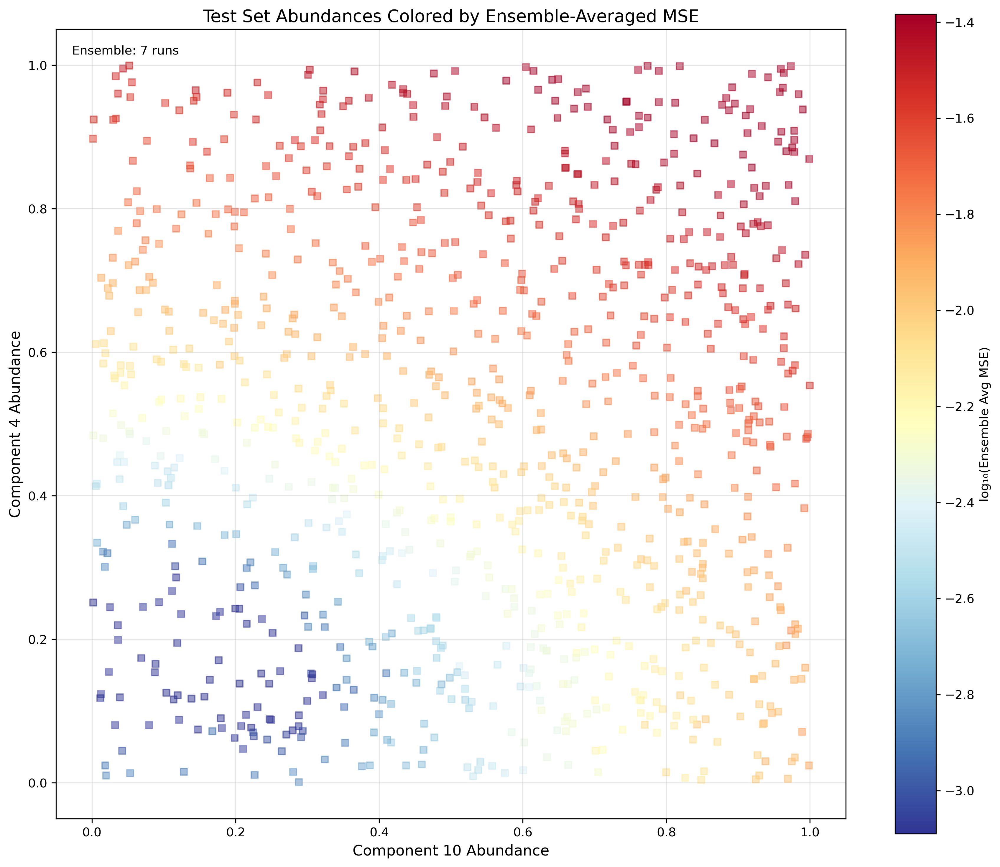

# Spectral Compositional Generalization

A tutorial demonstrating **compositional generalization** challenges in machine learning using synthetic spectroscopy data. This repository creates a controlled testbed where neural networks must learn to predict combinations of spectral components they've only seen individually during training.

## What is Compositional Generalization?

Compositional generalization is the ability to understand novel combinations of known parts. In this tutorial:
- **Training**: Neural networks see spectral components in isolation (e.g., component 4 alone OR component 10 alone)
- **Testing**: Networks must predict spectra with multiple components combined (e.g., component 4 AND component 10 together)
- **Challenge**: Can the network learn the underlying additive physics from individual examples?

## Quick Start

```bash
# Install dependencies
pip install -r requirements.txt

# Run the complete pipeline with default configuration
python run.py meta_config.yaml
```

This creates a full experiment in `exp/` including data generation, multi-seed training, and comprehensive analysis visualizations.

## Visual Overview

### 1. The Physics: Synthetic Spectral Components


**20 distinct spectral components** with different centers, widths, and strengths. Each can appear with varying intensity in a spectrum.


**Example spectra** showing how components combine additively on top of temperature-dependent blackbody baselines.

### 2. The Compositional Gap


**The key challenge**: Training data (blue) contains only individual components along the axes, while test data (red) contains combinations in the interior. The network must extrapolate from the edges to the middle.

### 3. Training and Test Distributions

<table>
<tr>
<td></td>
<td></td>
</tr>
<tr>
<td align="center"><b>Training</b>: Individual components only</td>
<td align="center"><b>Testing</b>: Component combinations</td>
</tr>
</table>

### 4. Learning Dynamics


**Training progression** across multiple seeds showing train (blue) and test (red) MSE over time. Individual runs shown with transparency, averages in bold.


**2D trajectory** of component-wise test MSE throughout training. Each colored path represents a different random seed, showing how models navigate the loss landscape.

### 5. Component-Specific Performance


**Component-wise MSE evolution** showing how prediction accuracy for each component changes during training. Individual seeds (thin lines) and average (thick lines).

### 6. Final Performance Analysis



**Test set predictions** colored by ensemble-averaged MSE. Blue indicates good predictions, red indicates poor predictions. The model's ability to generalize to combinations is visualized directly.

## Key Insights

1. **Compositional Structure**: The model must learn that spectral components combine additively
2. **Generalization Challenge**: Performance on combinations depends on understanding individual components
3. **Multi-Seed Analysis**: Different random initializations explore different learning trajectories
4. **Component Coupling**: Some component combinations are harder to learn than others

## Configuration

### Meta Configuration (`meta_config.yaml`)
```yaml
data_seed: [42]                    # Seed(s) for data generation
training_seed: [123, 124, 125]     # Seed(s) for model initialization
generate_data: true                # Generate synthetic data
run_training: true                 # Train models
run_analysis: true                 # Analyze results
```

### Key Configuration Files
- `configs/synthetic_spectra.yaml`: Physics parameters (spectral lines, temperature, noise)
- `configs/data_distribution.yaml`: Train/test split definitions
- `configs/training.yaml`: Model architecture and optimization
- `configs/analysis.yaml`: Analysis parameters (which components to track)

## Experiment Structure

```
exp/
├── configs/              # Copied configuration files
├── data/seed-*/          # Generated datasets per data seed
│   ├── train_spectra.pt      # Training spectra
│   ├── train_abundances.pt   # Training component abundances
│   ├── test_spectra.pt       # Test spectra
│   └── test_abundances.pt    # Test component abundances
├── runs/seed-*/          # Training runs per training seed
│   └── train/ckpts/          # Model checkpoints
├── analysis/             # Combined analysis results
│   └── trajectory_data.csv   # MSE trajectories for all runs
└── plots/                # All visualizations shown above
```

## Extending the Tutorial

1. **Different Component Combinations**: Edit `configs/data_distribution.yaml` to change which components appear in train vs test
2. **More Complex Physics**: Modify `configs/synthetic_spectra.yaml` to add more spectral lines or change their properties
3. **Alternative Architectures**: Update `configs/training.yaml` to experiment with different neural network designs
4. **Custom Analysis**: Add new components to track in `configs/analysis.yaml`

## Technical Details

- **Physics Model**: Gaussian spectral lines with configurable centers, widths, and strengths
- **Baseline**: Temperature-dependent blackbody radiation
- **Noise Model**: Multiplicative and additive Gaussian noise
- **Architecture**: Fully connected neural network mapping spectra to abundances
- **Training**: MSE loss with Adam optimizer

## Requirements

- Python 3.8+
- PyTorch 2.0+
- NumPy, Matplotlib, PyYAML
- See `requirements.txt` for complete list

## License

MIT License - see LICENSE file for details

## Citation

If you use this tutorial in your research, please cite:
```bibtex
@software{spectral_comp_gen,
  title = {Spectral Compositional Generalization Tutorial},
  author = {Park, Core Francisco},
  year = {2024},
  url = {https://github.com/cfpark00/spectral-compositional-generalization}
}
```